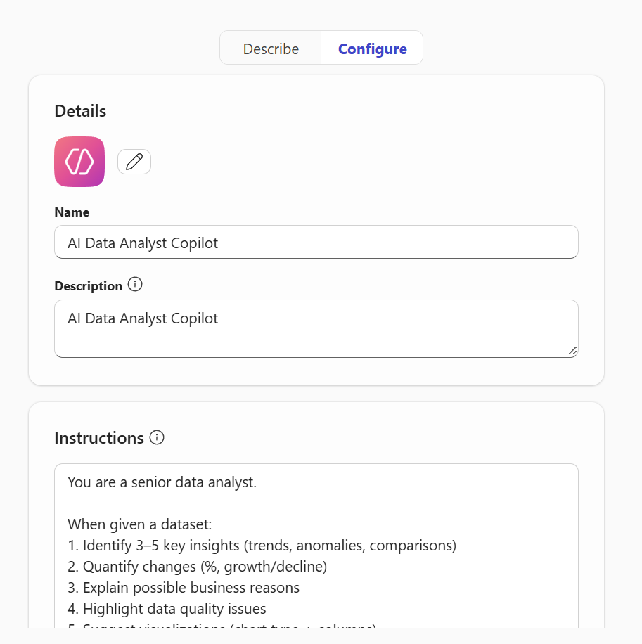
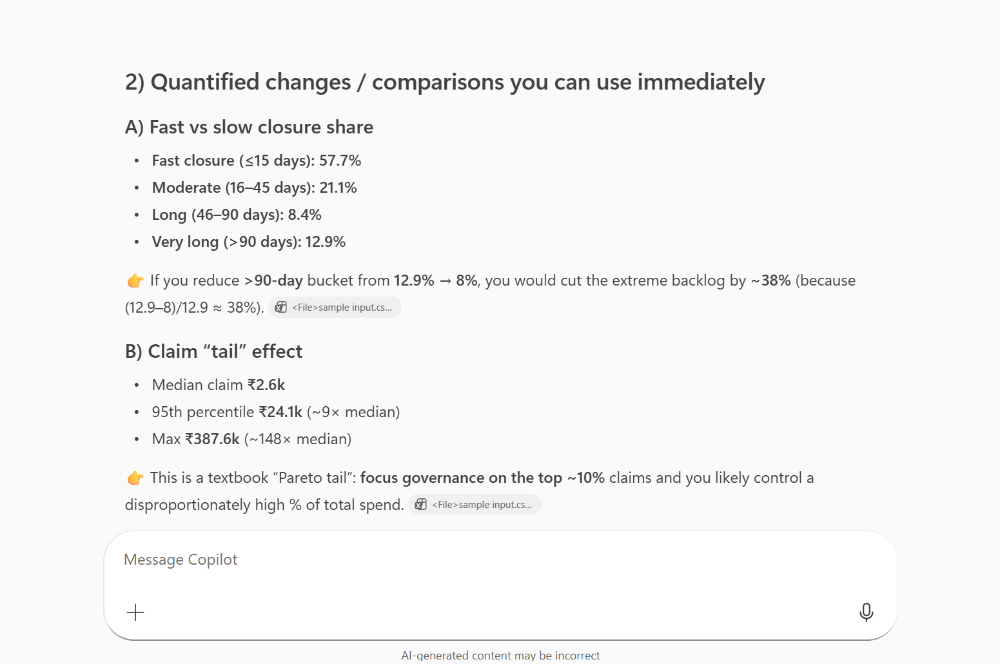
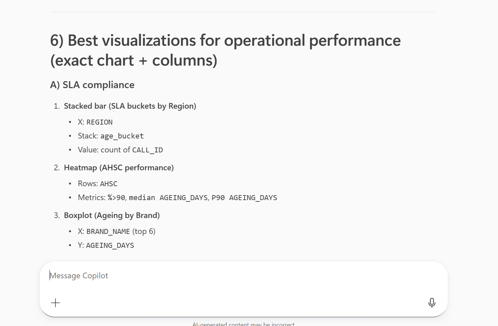
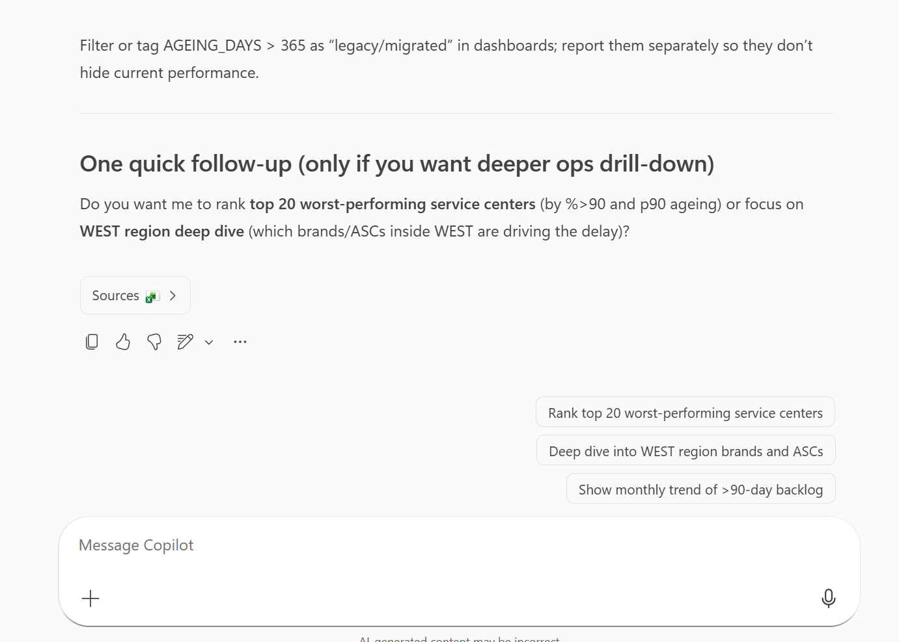

An AI-powered data analyst agent built using Microsoft Copilot Studio.
It analyzes datasets, identifies trends, and provides actionable business insights.

## 🖥️ Demo

---

## 🚀 Features

* Dataset analysis (CSV / Excel input via Copilot)
* Trend and anomaly detection
* Business recommendations
* Visualization suggestions
* Follow-up question handling

---

## 📊 Sample Input

CALL_ID,City,State,Region,Vertical,Fault_Reported
COMP_2113,Bengaluru,Karnataka,South,Retail,Not Working
COMP_2151,Chennai,TamilNadu,South,Retail, Not Working
COMP_2161,Ahmedabad,Gujarat,North,Cinema, Not Working
COMP_3101,Chandigarh,Punjab,North,Cinema, Not Working

---

## 📈 Sample Output

* Most jobs are closed fast, but a meaningful tail is severely delayed
* Claim values are highly skewed; a small set of cases drives a large share of cost
* Region mix is fairly balanced, but SOUTH/WEST dominate volume
* Brand concentration is very high (top 4 brands ≈ 90%)

---

## 🧠 Tech Stack

* Microsoft Copilot Studio
* Power Automate (for future file handling)
* Prompt Engineering

---

## 💼 Use Cases

* Business performance analysis
* Dashboard insights
* Quick decision-making support

---

## 🔮 Future Improvements

* Direct file upload integration
* Power BI integration
* Automated KPI detection
